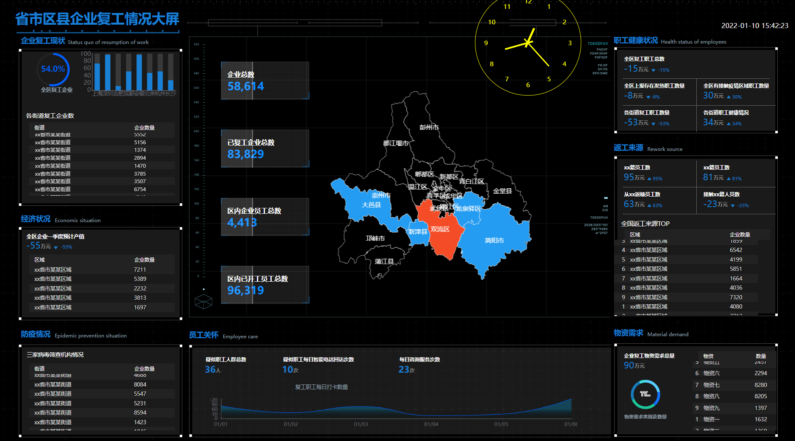

# 可视化大屏

## Project setup
```
npm install
```

### Compiles and hot-reloads for development
```
npm run serve
```

### Compiles and minifies for production
```
npm run build
```

### Lints and fixes files
```
npm run lint
```

### 特点

该可视化大屏运用vue框架进行构建，并且对可视化大屏中的每一部分都进行了模块化的处理，使每一部分的修改更加独立轻松

### 效果图

